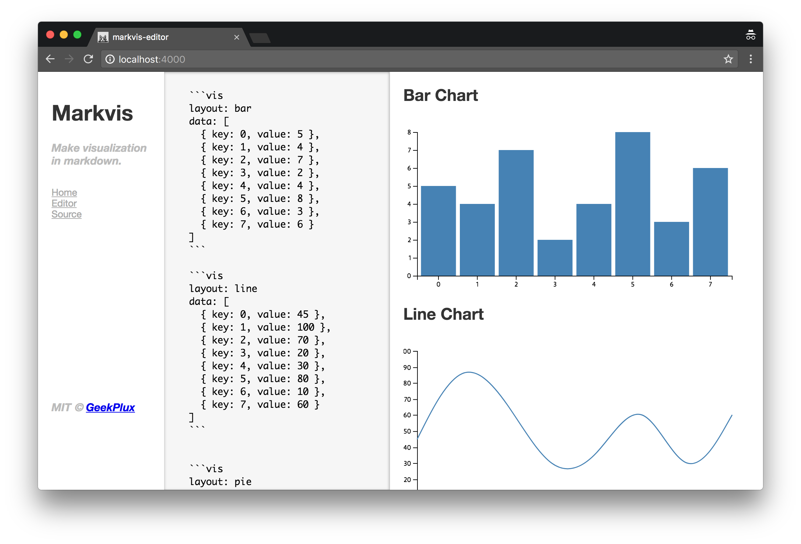

<p align="center">
  
</p>

# Markvis

> Make visualization in markdown.

[](https://npmjs.com/package/markvis) [](https://npmjs.com/package/markvis) [](https://travis-ci.org/geekplux/markvis) [](https://coveralls.io/github/geekplux/markvis) [](https://geekplux.github.io/donate)
[](https://app.fossa.io/projects/git%2Bhttps%3A%2F%2Fgithub.com%2Fgeekplux%2Fmarkvis?ref=badge_shield)

- [Documentation](https://markvis.js.org)
- [Online Editor](https://markvis-editor.js.org)

## Preview



# Quick Start

## Install

```bash
yarn add markvis --save
npm install markvis --save
```

## Usage

```js
const md = require('markdown-it')()
const vis = require('markvis')
const d3 = require('d3')  // in browser environment
const d3node = require('d3-node') // in node environment

md.use(vis).render(`
  your makrdown content
`, {
  d3,    // in browser environment
  d3node // in node environment
})
```

there are [Examples](./test/test.js) which in node environment.

# Motivation

Very often we need to insert some data into our articles to make them more convincing, and since we are more sensible of information in charts than statistics, how to easily and conveniently embed a chart in an article is important. However, common method is to export a chart as an image, then upload it to an Image Hosting and get a url, finally paste the url to editor, which is a tedious process from writer's perspective.

Also, it makes the image loading time become much longer than that of the DOM elements, which may be/is a bad experience from reader's  perspective.


# API

There are many options you can config and below is some in common. But you'd better to config the options which related to chart style in chart options, such as [markvis-bar](https://github.com/geekplux/markvis-bar), [markvis-line](https://github.com/geekplux/markvis-line), [markvis-pie](https://github.com/geekplux/markvis-pie).

## options

##### data

- Type: `Array`

Data from file or web processed by d3 library.

##### d3

- Type: `Object`

[d3](https://github.com/d3/d3) library which used in **browser** environment.

##### d3node

- Type: `Function`

[d3-node](https://github.com/d3-node/d3-node) constructor which used in **node** environment.

##### selector

- Type: `String`
- Default: `'#chart'`

DOM selector in container.

##### style

- Type: `String`<br>
- Default: `''`

Chart style.

##### width

- Type: `Number`<br>
- Default: `960`

SVG width for chart.

##### height

- Type: `Number`<br>
- Default: `500`

SVG height for chart.

##### margin

- Type: `Object`<br>
- Default: `{ top: 20, right: 20, bottom: 20, left: 20 }`

Margin of the first <g> wrapper in SVG, usually used to add axis.


# Contributing

1. Fork it!
2. Create your feature branch: `git checkout -b my-new-feature`
3. Commit your changes: `git commit -am 'Add some feature'`
4. Push to the branch: `git push origin my-new-feature`
5. Submit a pull request :D


# LICENSE

**markvis** © [geekplux](https://github.com/geekplux), Released under the [MIT](./LICENSE) License.<br>
Authored and maintained by geekplux with help from contributors ([list](https://github.com/geekplux/markvis/contributors)).

> [geekplux.com](http://geekplux.com) · GitHub [@geekplux](https://github.com/geekplux) · Twitter [@geekplux](https://twitter.com/geekplux)


[](https://app.fossa.io/projects/git%2Bhttps%3A%2F%2Fgithub.com%2Fgeekplux%2Fmarkvis?ref=badge_large)
